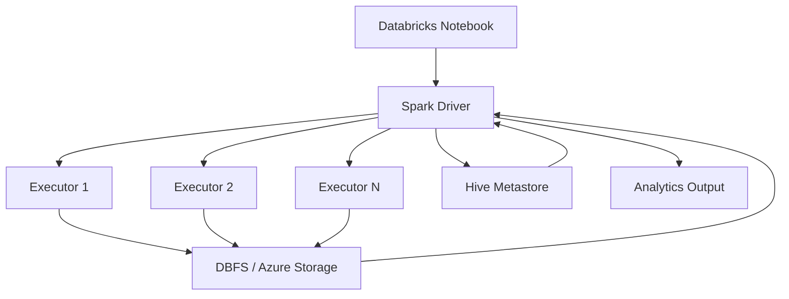

# Retail & Economic Data Analytics with PySpark

## Introduction

This project analyzes retail transaction data to uncover customer behavior, sales trends, and revenue distribution. Key business goals include identifying monthly sales performance, tracking customer activity, and segmenting high-value customer groups — insights that can drive better customer retention, sharper marketing strategies, and increased revenue.

---

## Technologies Used

| Category | Tools |
|---|---|
| Compute | PySpark (DataFrame API, Window Functions) |
| Platforms | Azure Databricks, Apache Zeppelin |
| Cluster | Google Cloud Dataproc (Hadoop) |
| Storage | HDFS, DBFS, Azure Data Lake Storage, GCS |
| File Format | Parquet |
| Metadata | Hive Metastore |

---

## Part 1: Databricks & Hadoop Implementation

### Dataset & Analytics

Retail transaction data was analyzed using PySpark in Azure Databricks, sourced from:

```
demoworkspacejoby.default.retail_data_analytics
```

**Work performed:**

- Loaded dataset from Hive Metastore
- Cleaned data — removed duplicates, null customers, and invalid prices
- Engineered derived columns: `Revenue`, `invoice_year_month`, `is_cancelled`
- Monthly aggregations: total orders, cancelled orders, placed orders, sales, and growth rate
- Customer analytics: monthly active users, new vs. existing user segmentation
- RFM segmentation using window functions (Recency, Frequency, Monetary scoring)
- Revenue contribution analysis by customer segment (Champions, Loyal Customers, At Risk, etc.)

**Notebook:** `spark/notebook/retail_data_analytics_Final.ipynb`

### Architecture

```
Platform:  Azure Databricks
Compute:   Apache Spark (PySpark)
Storage:   DBFS / Azure Data Lake Storage
Metadata:  Hive Metastore
```

**Data Flow:**

```
Databricks Notebook → Spark Driver → Executors (parallel) → Storage → Aggregated Results → Analytics Output
```

### Architecture Diagram



---

## Part 2: Zeppelin & Hadoop Implementation

### Dataset & Analytics

Economic (GDP) and retail-related analytics were performed using PySpark in Apache Zeppelin on a Hadoop cluster (GCP Dataproc), sourced from:

```
wdi_csv_parquet
```

**Work performed:**

- Queried GDP growth data and filtered Canada-specific records using SQL
- Cleaned data using `TRIM` and `LOWER`
- Performed year-wise sorting and trend analysis
- Distributed processing with `DISTRIBUTE BY` and `SORT BY`
- Identified the maximum GDP growth year per country

**Notebook:** `spark/notebook/Spark Dataframe - WDI Data Analytics.ipynb`

### Architecture

```
UI:       Apache Zeppelin
Compute:  Apache Spark (PySpark)
Cluster:  Google Cloud Dataproc (Hadoop)
Storage:  HDFS / GCS (Parquet)
Metadata: Hive Metastore
```

**Data Flow:**

```
Zeppelin Notebook → Spark Driver → Executors → HDFS/GCS → Results → Zeppelin UI
```

---

## Future Improvements

1. **Bronze → Silver → Gold architecture** — Separate raw, cleaned, and analytics layers for better scalability and maintainability.

2. **Performance optimization** — Add partitioning by `invoice_year_month`, and apply Spark tuning techniques such as broadcast joins, caching, and partition optimization.

3. **Delta Lake integration** — Enable ACID transactions, data versioning, and efficient upserts.

4. **Pipeline automation** — Schedule jobs using Databricks Workflows or Apache Airflow.

5. **Visualization layer** — Connect analytics output to dashboards via Power BI or Looker Studio.